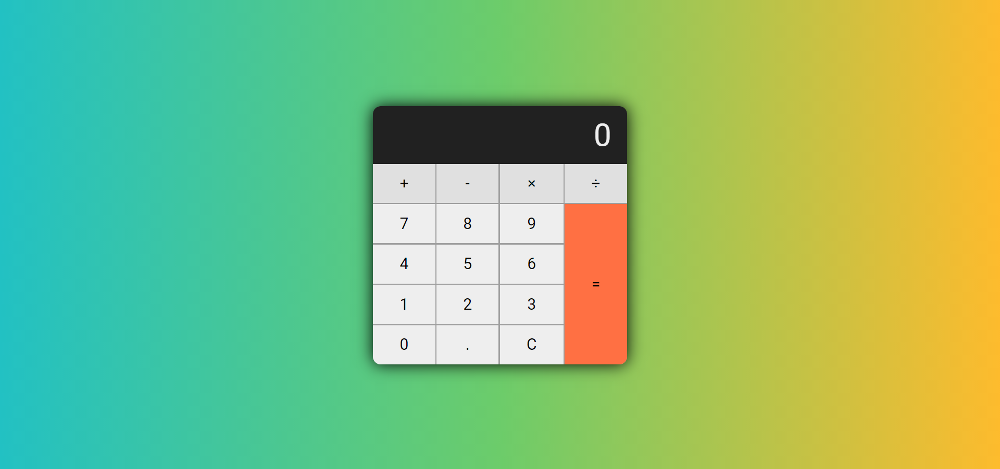

# TypeScript-firstCalc

## Table of contents
* [General info](#general-info)
* [Technologies](#technologies)
* [Inspiration](#inspiration)
* [Available Scripts](#available-scripts)
* [Screenshots](#screenshots)

# General info
First self made aplication in TypeScript technology. The calculator was created as a simple exercise to allow easier entry into the world of TypeScript

## Technologies
Project is created with: 
* HTML5
* CSS 3
* TypeScript

## Available Scripts
### `npm start`

Runs the app in the development mode. 
Open [http://localhost:3000](http://localhost:3000) to view it in the browser.

The page will reload if you make edits. 
You will also see any lint errors in the console.

## Screenshots

